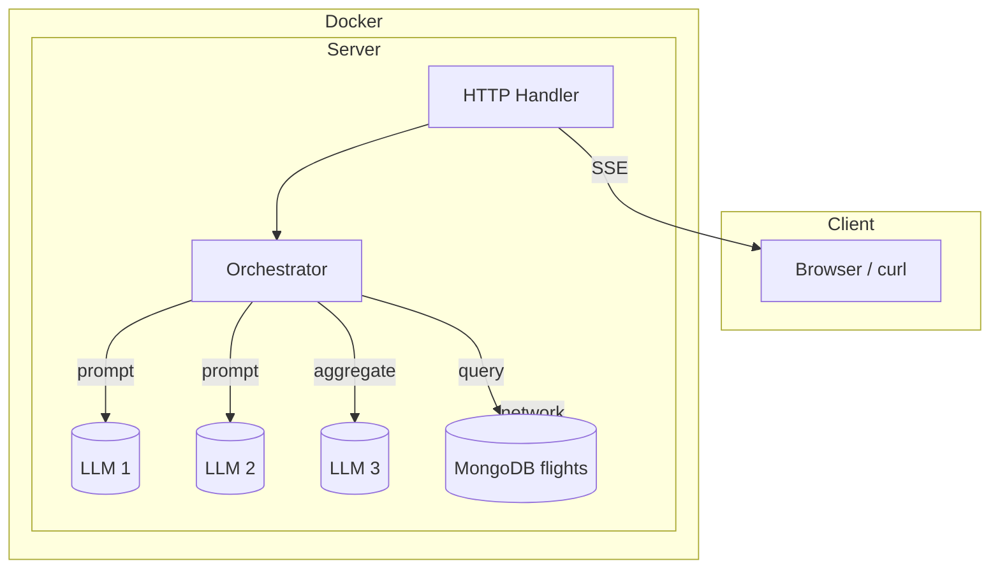

# Go LLM Chat – Multi-LLM Orchestrator Demo

This project demonstrates a multi-LLM orchestration system written in Go. It shows how to:

1. Orchestrate multiple LLMs (OpenAI GPT-4o-mini models) with different prompts.
2. Stream answers to the caller using Server-Sent Events (SSE).
3. Enrich answers with domain data (a MongoDB collection of fictional flight data).
4. Support **multilingual queries** (English and Spanish).
5. Run everything locally with **Docker Compose**

---

## Architecture



* **LLM 1** – concise, formal replies (or list of flights when the question is about flights).
* **LLM 2** – verbose, friendly replies (or duration & cost when the question is about flights).
* **LLM 3** – aggregation layer that combines LLM1 and LLM2 responses.

When the user's question mentions *flights* (in English or Spanish) the orchestrator:

1. Extracts **origin** / **destination** city names using a simple synonym map.
2. Queries MongoDB for matching flights (case-insensitive, supports wildcard searches).
3. Feeds the flight list to both LLMs with different prompts.
4. **LLM3 aggregates** both responses into a unified, well-formatted answer.
5. Streams back the final aggregated response via SSE.

For non-flight questions, LLM1/LLM2 are given the user's question with their respective style prompts, and **LLM3 combines** the formal and friendly perspectives into one balanced response.

---

## Multilingual Support

The system supports queries in both **English** and **Spanish**:

* **Flight queries** work in both languages (e.g., "flights to London" / "vuelos a Londres")
* **General questions** are processed in the language they're asked
* **City name variations** are automatically mapped (e.g., "Londres" → "London", "Madrid" → "Madrid")
* **Airport codes** are supported (e.g., "JFK" → "New York", "MAD" → "Madrid")

The LLMs maintain the original language in their responses, providing a seamless multilingual experience.

---

## Getting Started

### Prerequisites

* Go 1.22+
* Docker & Docker Compose (optional but easiest)
* An **OpenAI API key** (set `OPENAI_API_KEY`).

### Clone & run with Docker Compose (recommended)

```bash
# 1. Clone the repo
$ git clone https://github.com/Cris245/go-llm-chat.git
$ cd go-llm-chat

# 2. Export your OpenAI key (or use a .env file)
$ export OPENAI_API_KEY="sk-…"

# 3. Start everything
$ docker-compose up --build
```

Docker Compose spins up:

* **MongoDB** on `mongodb://mongo:27017` (aliased as `MONGO_URI`).
* **Go server** on `http://localhost:8080`.

On first start the server **seeds** the `flightdb.flights` collection with a set of 20 sample flights (Madrid ↔ Paris, London ↔ Berlin, Tokyo → LA, …). Seeding is done via **upsert**, so re-starts won't duplicate data.

### Run natively (Go only)

1. Start MongoDB locally (`brew services start mongodb-community@7` or similar).
2. Export environment variables:
   ```bash
   export MONGO_URI="mongodb://localhost:27017"
   export OPENAI_API_KEY="sk-…"
   ```
3. Run the server:
   ```bash
   go run ./cmd/server
   ```

---

## API

`POST /api` with **plain-text** body. The response is an **SSE** stream.

### Events

| Event `Type` | Meaning                               | Example `Data`                   |
|--------------|---------------------------------------|----------------------------------|
| `Status`     | Internal status update (invoking LLM) | `Invoking LLM 1`                 |
| `Message`    | Final aggregated answer               | See example below                |

### Curl Examples

List all flights:
```bash
curl -N -X POST -d "Que vuelos hay en general?" http://localhost:8080/api
```

Ask for specific route:
```bash
curl -N -X POST -d "hay vuelos a londres?" http://localhost:8080/api
```

General (non-flight) question:
```bash
curl -N -X POST -d "Explain quantum teleportation in simple terms" http://localhost:8080/api
```

The `-N` flag keeps the connection open so you see the `Status` events followed by the `Message`.

---

## Load Testing

The project includes a load testing script to validate concurrent request handling:

```bash
# Test 5 simultaneous requests
./scripts/load_test.sh 5

# Test 10 simultaneous requests  
./scripts/load_test.sh 10
```

The script sends multiple concurrent requests and validates that:
- All requests receive responses
- No requests are lost or dropped
- Server maintains performance under load
- SSE streams work correctly with multiple clients

---

## Challenges Faced & Solutions

### 1. **Multi-LLM Orchestration Complexity**
**Challenge**: Coordinating three LLMs with different roles while maintaining response quality.
**Solution**: Implemented parallel processing with `sync.WaitGroup` and channels, ensuring LLM1 and LLM2 run concurrently, then LLM3 aggregates their results.

### 2. **Enhanced NLP for Flight Queries**
**Challenge**: Extracting flight parameters (cities, dates, prices) from natural language in multiple languages.
**Solution**: Built comprehensive regex patterns and city synonym maps supporting airport codes (JFK → New York), multi-language variations (Londres → London), and price constraints.

### 3. **Real-time Streaming with SSE**
**Challenge**: Providing live status updates during multi-step LLM processing.
**Solution**: Implemented Server-Sent Events with proper event channels, allowing clients to see real-time progress through each LLM invocation.

### 4. **Concurrent Request Handling**
**Challenge**: Ensuring the system can handle multiple simultaneous users without losing requests or mixing responses.
**Solution**: Used Go's goroutines and proper channel management to handle concurrent requests independently, with each request getting its own SSE stream.

### 5. **MongoDB Integration & Data Consistency**
**Challenge**: Managing flight data with upsert operations and ensuring data consistency across restarts.
**Solution**: Implemented upsert-based seeding that prevents duplicates while ensuring fresh data on each startup.

### 6. **Error Handling & Resilience**
**Challenge**: Building a robust system that gracefully handles LLM failures, network issues, and partial responses.
**Solution**: Implemented fallback mechanisms where if LLM3 aggregation fails, the system combines LLM1 and LLM2 responses directly.

---

## Project Layout

```
cmd/
  server/            # main.go – HTTP + SSE + orchestration wiring
internal/
  db/                # MongoDB client, models & seed data
  llmclient/         # Thin wrapper around OpenAI ChatCompletion
  orchestrator/      # Core logic (detect flights, prompt LLMs, merge)
  sse/               # Minimal SSE helper
scripts/
  load_test.sh       # Concurrent request testing script
Dockerfile           # Builds the Go binary for prod
Docker-compose.yml   # Mongo + server services
```

---

## Next Steps
- Ability to connect to actual GDS (Global Distribution System) and PSS (Passenger Service System) to get real flight information.
- Hot reload for Docker development so each code change deploys new containers automatically.
- Simple web UI to make the system more user-friendly and visually clear.
- API rate monitor
